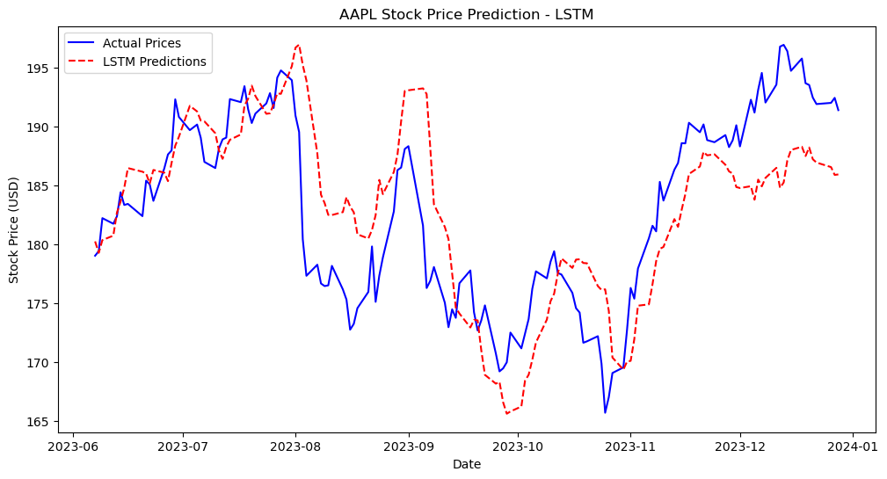

# 📈 Stock Price Prediction Using LSTM

This project predicts the **next day's closing stock price** using an **LSTM (Long Short-Term Memory) deep learning model**. 

## 🚀 Features
✅ Uses **LSTM model** for sequential learning.  
✅ Fetches **real-time stock data** from Yahoo Finance.  
✅ Predicts **next-day closing prices** for any stock.  
✅ Uses **technical indicators (SMA, EMA, RSI, etc.)** for better accuracy.  

## 📌 How It Works
1. The program fetches recent stock price data using Yahoo Finance.
2. It extracts **key technical indicators** like SMA (Simple Moving Average), EMA (Exponential Moving Average), and RSI (Relative Strength Index).
3. The **LSTM model processes the time-series data** and predicts the next day’s closing price.
4. Finally, it displays the **predicted stock price trend**.

## 🛠 Installation & Usage
### 1️⃣ Clone the Repository
```bash
git clone https://github.com/RishiChandan/stock-price-prediction.git
cd stock-price-prediction

## 📊 LSTM Stock Price Prediction Output
Below is the **LSTM model's prediction** compared to actual stock prices:


